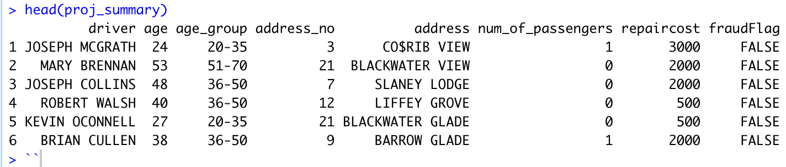

```{r setup, include= FALSE}
knitr::opts_chunk$set(
    echo = FALSE,
    message = FALSE,
    warning = FALSE,
    out.width = "100%",
    out.height = "500px",
    fig.align = "center")
```


```{r}
library(tidyverse)
library(lubridate)
library(knitr)
library(bookdown)
```


```{r}
project <- read.csv('datafolder/data.csv')
df <- data.frame(project)
df1 <- df
df1[df1 == ""] <- NA
```


## Introduction

Exploratory Data Analysis will be used in this project to examine the Insurance Fraud Dataset and give the business insight (EDA). Any action taken to manipulate the insurance system is referred to as insurance fraud. It happens when a claimant, in this case, drivers or passengers, tries to get something for which they are not eligible. Hard insurance fraud is when someone purposefully fabricates an accident; soft insurance fraud is when someone makes a legitimate insurance claim but fabricates a portion of it. The goal of this research is to investigate the fraud datasets and offer insights.

## Solution Summary

The steps taking 

1. Data cleaning process

2. Feature engineering to aid process 

3. Gain insights through visualization

4. Conclusions

## Data Cleaning Proccess

The data were cleaned using the following procedure before being subjected to an exploratory analysis.

1. To show the relationship between a driver's age and certain behavioral characteristics associated with insurance fraud, I formed an age group.

2. To get a separate column for the address name and number, I used the str splt() technique.

3. To reduce repair costs and create a consistent column, I replaced and eliminated any unnecessary characters.

Then, the data that have been cleansed and are prepared for exploratory analysis are chosen.

```{r}
d_f = c('k|~')

project1 = df1 %>% 
    mutate(age_group = dplyr::case_when(age <= 35 ~ "20-35",
                                        age > 35 & age <= 50 ~ "36-50",
                                        age > 50 & age <= 70 ~ "51-70",
                                        age > 70  ~ "> 70"),
           age_group = factor(age_group,
                              level = c("20-35", "36-50", "51-70", "> 70")),
           address_no = str_split(address, ' ', simplify = T) [,1],
           address1 = str_split(address, ' ', simplify = T) [,2],
           address2 = str_split(address, ' ', simplify = T) [,3],
           pass1 = ifelse(!is.na(passenger1), 1, 0),
           pass2 = ifelse(!is.na(passenger2), 1, 0),
           repaircost = str_remove_all(repaircost, 'approx '),
           repaircost = str_replace_all(repaircost, d_f, '000' ),
           repaircost = str_replace_all(repaircost, '!!', '00'),
           repaircost = ifelse(repaircost == '$*0', '500', repaircost))
```


```{r}
project2 = project1 %>% 
    mutate(first_name = str_split(driver, ' ', simplify = TRUE)[,1],
           second_name = str_split(driver, ' ', simplify = TRUE)[,2],
           pass1_firstname = str_split(passenger1, ' ', simplify = TRUE) [,1],
           pass1_secondname = str_split(passenger1, ' ', simplify = TRUE)[,2],
           pass2_firstname = str_split(passenger2, ' ', simplify = TRUE)[,1],
           pass2_secondname = str_split(passenger2, ' ', simplify = TRUE)[,2],
           second_name = str_replace_all(second_name, 'M%RAN', 'MORAN'),
           second_name = str_replace_all(second_name, 'H!GGINS', 'HIGGINS'),
           second_name = str_replace_all(second_name, 'OCONN!LL', 'OCONNILL'),
           second_name = str_replace_all(second_name, 'SHE!HAN', 'SHEIHAN'),
           second_name = str_replace_all(second_name, 'OD<NOGHUE', 'ODONOGHUE'),
           second_name = str_replace_all(second_name, 'HI?GINS', 'HIGGINS'),
           address1 = str_replace_all(address1, 'BAR&OW', 'BARROW'),
           address1 = str_replace_all(address1, 'COR/IB', 'CORRIB'),
           address1 = str_replace_all(address1, 'BAR%OW', 'BARROW'),
           address1 = str_replace_all(address1, 'BLAC#WATER', 'BLACKWATER'),
           address1 = str_replace_all(address1, 'SL%NEY', 'SLANEY'),
           address1 = str_replace_all(address1, 'DOD/ER', 'DODDER'),
           address1 = str_replace_all(address1, 'BLACK%ATER', 'BLACKWATER'),
           address1 = str_replace_all(address1, 'BOYN$', 'BOYNE'),
           address1 = str_replace_all(address1, 'DOD!\xa3R', 'DODDER'),
           address1 = str_replace_all(address1, 'BLAC&*ATER', 'BLACKWATER'),
           address1 = str_replace_all(address1, 'BLACKWA^%R', 'BLACKWATER'),
           address1 = str_replace_all(address1, 'BARR$', 'BARROW'),
           address1 = str_replace_all(address1, 'S+_ERN', 'SLANEY'),
           address1 = str_replace_all(address1, 'DODDXX', 'DODDER'),
           address1 = str_replace_all(address1, 'DODD!!', 'DODDER'),
           address1 = str_replace_all(address1, 'L=$FEY', 'LIFFEY'),
           address1 = str_replace_all(address1, 'SLA!!!', 'SLANEY'),
           address1 = str_replace_all(address1, 'SLA"!Y', 'SLANEY'),
           address1 = str_replace_all(address1, 'L%FFEY', 'LIFFEY'),
           address1 = str_replace_all(address1, 'SHAN*ON', 'SHANNON'),
           address1 = str_replace_all(address1, 'LI%"?Y', 'LIFFEY'),
           address1 = str_replace_all(address1, 'C+_AC', 'CAMAC'),
           address1 = str_replace_all(address1, 'B&:NE', 'BOYNE'),
           address1 = str_replace_all(address1, 'SL::EY', 'SLANEY'),
           address1 = str_replace_all(address1, 'CO$RIB', 'COSRIB')) %>% 
    unite(col = driver, first_name:second_name) %>% 
    unite(col = address, address1:address2) %>% 
    mutate(driver = str_replace_all(driver, '_', ' '),
           address = str_replace_all(address, '_', ' '),
           num_of_passengers = (pass1 + pass2))
proj_summary <- project2 %>%
    select(driver, age, age_group, address_no, address, num_of_passengers, repaircost, fraudFlag) 
```

## Feature Enginnering

Feature engineering is employed to speed up the exploratory data analysis procedure. For exploratory data analysis, Feature engineering is the process of turning raw data into features that more accurately depict the underlying issue. In this instance, the number of passengers present is 1 and the number of passengers absent is 0. This is done to enhance exploratory visualization. A portion of the cleaned dataset used for the exploratory study is displayed in the image below.

```{r echo = FALSE, fig.cap="", out.width = '100%'}

```


## Exploratory Analysis

The following stage is to obtain some understanding of the nature of auto insurance fraud in relation to the behavior of those who commit it.

```{r echo=FALSE, fig.cap = "Age Group Distribution with RepairCost"}

proj_summary %>%
    
    # ggplot
   ggplot(aes(x = age_group, y = repaircost, color = repaircost)) + geom_col() +
    
    # formatting
    labs(title = "Age Group Distribution with Repair Cost", x = "age_group", y = "repaircost") +
    facet_grid(~factor(repaircost, levels = c('500','1000','2000','3000','above 3000'))) +
    theme(axis.text.x = element_text(angle = 90, vjust = 1, hjust =1),
          axis.text.y = element_blank(),
          axis.ticks.y = element_blank())

```

According to the graph above, the category of 500 repair costs experiences the most fraud. It also happens to be the least expensive in terms of repairs, which implies that some scams take place when the repairs cost is more than 3000. The graph shows that the age group between 20 and 35 is the one most frequently involved in fraud across all repair costs. In contrast, across all repair cost categories, the fraud rate for age groups above 70 is comparatively low.


```{r echo=FALSE, fig.cap = "highligts the variation in repaircost"}

proj_summary %>%
    # ggplot
  ggplot(aes(x = repaircost, y = age, color = repaircost)) + labs(title = "Boxplot of ages by Repaircost", x = "repaircost", y = "age") +
      geom_boxplot(outlier.color = "red")
```

The boxplot shows that the median age of repair cost claims over 3,000 is higher. Given that the type of car would affect the amount requested for repairs, this suggests that the cost of repairs would be more in this situation than 3,000 for a luxury car. The fact that their repaircost claim is over 3,000 may further indicate that age groups over 70 drive expensive vehicles.

```{r echo=FALSE, fig.cap = "Highlights the impact of age group in Fraud Insurance "}

proj_summary %>%
ggplot(aes(x = age_group, y = fraudFlag, color = fraudFlag)) + geom_col() + 
    #formatting
    labs(title = "FraudFlag vs Age Group", x = "age_group", y = "fraudFlag") +
    facet_wrap(vars(fraudFlag)) +
    theme(plot.title = element_text(hjust = 0.5)) +
    theme(axis.text.x = element_text(angle = 90, vjust = 1, hjust =1),
          axis.ticks.x = element_blank())
```

While the age group over 70 is involved in the least amount of fraud, the 20 to 35 age group had the highest number of vehicle insurance fraud. 


```{r echo=FALSE, fig.cap = "Proportion of number of Passengers involved in Fraud "}
proj_summary %>%
  ggplot(aes(x = num_of_passengers,fill = fraudFlag)) + geom_bar(position = "fill") +
    labs(title = "Proportion of Passengers involved in Fraud", x = "num_of_passengers", fill = "fraudFlag") +
    theme(plot.title = element_text(hjust = 0.5))
```

According to the graph above, the fraud rate was higher when there were more passengers This indicates that the proportion of fraud increased when there were 2 passengers compared to just 1 or none. A fraud incidence was reported in 60% of the circumstances involving two travelers. Additionally, in more than 80% of cases involving only one passenger, there was no fraud discovered.


## Conclusion 

The following are the conclusions reached after the exploratory analysis: 

* The average repair cost claim for fraudulent auto insurance is 500. 

* The majority of vehicle insurance fraudsters are in the 20–35 age bracket. 

* Older individuals drive high-end vehicles 

* The likelihood of auto insurance fraud increases with the number of passengers.


